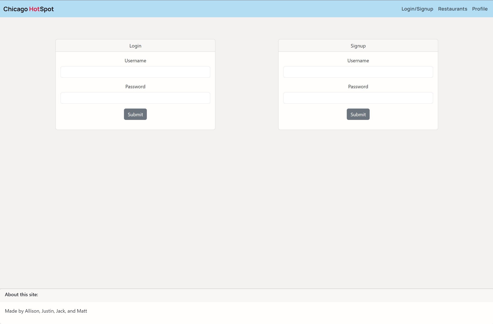
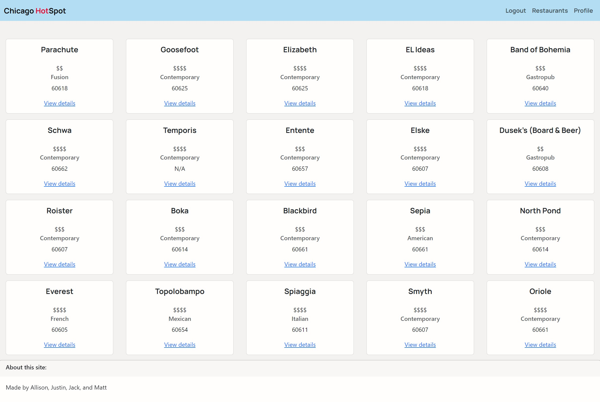
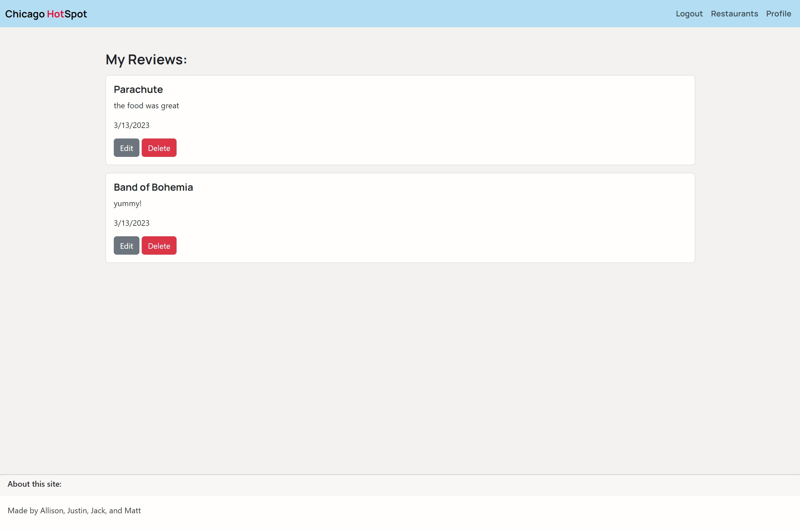

# Chicago HotSpot
[Heroku Link](https://ancient-wildwood-93900.herokuapp.com/)

## Description
An interactive full stack application that allows user to view Michelin star restaurants located in Chicago. This application follows the MVC paradigm in its architectural structure, using Handlebars.js as the templating language, Sequelize as the ORM, and the express-session npm package for authentication. Users can interact with the website by leaving reviews for restaurants and visiting the Michelin Guide for each location. 

## Table of Contents
- [Usage](#usage)
- [Credits](#credits)
- [License](#license)
- [Contributing](#contributing)
- [Questions](#questions)

## Usage
Use the app via the Heroku link

## Credits
This project was a collaborative effort between group members Matt, Allison, Justin, and Jack (see below for our individual GitHub profiles).

## License
This project is protected by the MIT license.
## Contributing
Contributor Covenant v2.1

## Questions?
[GitHub Repo](https://github.com/allisonnault/Chicago-Attractions)

If you have any questions, contact us on GitHub:

[Matt Osborne](https://github.com/MattOz)

[Allison Nault](https://github.com/allisonnault)

[Justin Canavan](https://github.com/justincanavanmusic)

[Jack Kelly](https://github.com/Carnificis)

